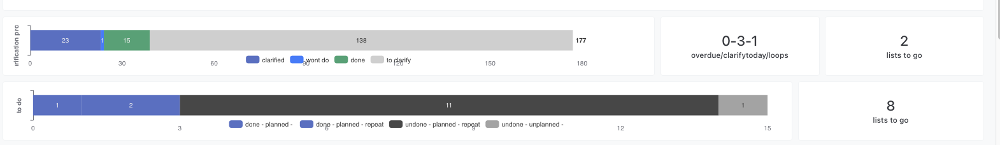
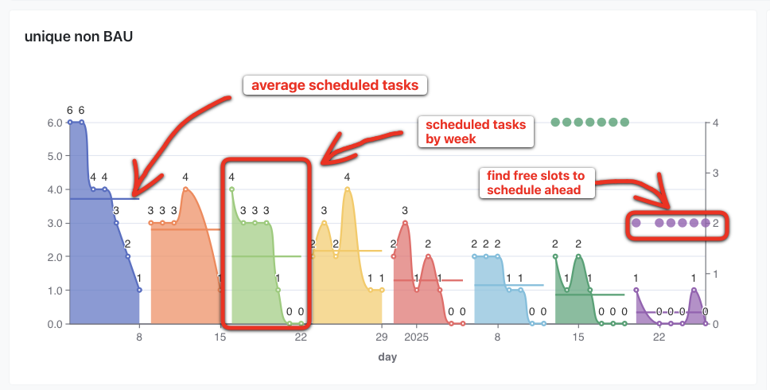
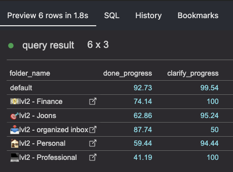
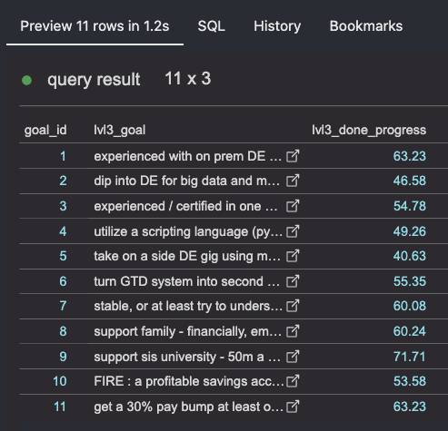

[](https://github.com/luutuankiet/ticktick-py-dbt/actions/workflows/CI.yml)
[](https://github.com/luutuankiet/ticktick-py-dbt/actions/workflows/CD.yml)

# Ticktick DBT models
This is a set of base Ticktick data models designed to reflect the [GTD's horizon of focus](https://gettingthingsdone.com/2011/01/the-6-horizons-of-focus/). 

A complete setup includes
- Extraction pipeline that uses the non-official [ticktick-py library](https://github.com/lazeroffmichael/ticktick-py) to extract your account's data from Ticktick.
- Modelled data for analytics, **which is the scope of this repo.**
- A BI tool to visualize the data, for instance [lightdash](https://github.com/lightdash/lightdash).

## motivation   
Although Ticktick alreay has [a lot of built in dashboards and visualizations](https://help.ticktick.com/articles/7055781966800486400), they are aimed for the general audience thus won't be very versatile when it comes to reviewing your completed tasks by GTD horizons.

This is very crucial as the act of reviewing is arguably the most important part to keep a GTD system functional.


## Features & integrations

### dbt models
```
.
├── marts
│   ├── core
│   └── metrics
└── staging
    └── base
```

- All models are configured with appropriate tests.
- Snapshots are used to track changes in the data.
- `dbt_profiles.yml` with a variable-based `CI` profile compatible with slim CI/CD workflows.


### GTD-based metrics & models
With the help of these models you can slice and dice your data by the horizon of focus dimensions like so :

#### level 0 : your day to day tasks.

utilizes `fact_todos` model with grain at the task level.
to answer questons such as: 
- "how many tasks do I have to capture / clarify / do today?"
- "what's the clarification progress of my tasks across all projects?"


to go one step further, create a lookahead view of your upcoming weeks' task distribution to help schedule acordingly: 



#### level 1 : projects (lists)

utilizes `lvl1_progress` model which aggregates all your tasks by project (lists)
to answer questons such as:
- "what's the clarify / done progress of my lists?"
- "what are some lists that need my attention / should be archived?"


#### level 2 : area of focus (folders of lists) 

utilizes `lvl2_progress` model which aggregates all your lists by folder (area of focus) and find how how well you are progressing on your area of focus.



#### level 3 : 1-3 years goals

Utilizes `lvl3_progress` model plus a csv file you create that maps which list belongs to  which goal.
This combination can show a rough progress how you are doing with your 1-3 years goals.




#### level 4-5 : 
This is outside of the scope of this project because metrics at this level are too coarse to be quantified. But, the previous levels should be enough as stepping stones to help you review this level.

#### bonus : habit heatmap

The `fact_todos` model comes with a built in windowing logic that detects & log streaks for repeating tasks. 

With some dashboard wizardy you can create an [everyday](https://everyday.app/)-inspired habit heatmap:


The gist of this dashboard is to help tracking your habits habit (which I took from the [atomic habit](https://www.goodreads.com/book/show/40121378-atomic-habits) book)
- first step to build habit is commit to showing up - in the first couple recurrences aim to spend 2 minutes with it and you're good for the day
- falling to check in repeatedly also builds up a habit. if you see yourself building this bad habit, try to aim to show up for 2 minutes first to break the chain
- roll with the punches - if you find it hard to keep up with a habit, maybe it's not meant for ya, time to discard it


## Integrations
- lightdash. all models in the `models/marts` folder have pre defined yaml files compatible with lightdash.


## Setting up and Prerequisite:
### pre requisites
- Data already extracted from Ticktick (by ticktick-py client) into a dw. A follow up repo will be created to help you extract your data.
- A live data warehouse (DW) to load the data. Most of the models here use PostgresSQL dialect.
- dbt installed, preferrably to `.venv` dir.

### quickstart
- clone the repo and cd into it.
- install the pip requirements : 
```
python -m venv .venv &&\
source .venv/bin/activate &&\
pip install -r requirements.txt
```
- create a seed file `list_goal_mapping.csv` from the example `list_goal_mapping_sample.csv`. 
  - You can use the sample file content to quickstart the initial run.
  - This should affect models with `lvl_` prefix. `fact_todos` and `obt` models should run fine without it.
- build your dbt project : `dbt deps & dbt build`

## future work
- [ ] detailed models documentations. there's a lot going on with `facts_todo` that needs to be documented other gets confusing why the logics are the way they are.
- [ ] document the objects used from ticktick-py used as source for the models (tasks, lists, folders). Also identify the additional derived fields from the source.
- [ ] document specific tags and ticktick lists setup that the lvl1 > 3 models expect
- [ ] how to run the project by individual GTD levels instead of 1 > 3 as a whole.
- [ ] ability to opt out of dummy lookahead records in `fact_todos` model.
- [ ] correct handling of raw data in json and array type; currently all are treated as strings.


