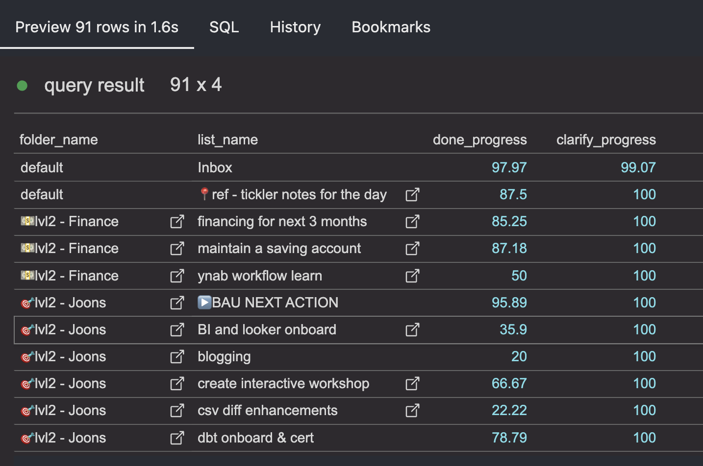

# dbt models for ticktick data
this is a base set of models designed to reflect the [GTD's horizon of focus.](https://gettingthingsdone.com/2011/01/the-6-horizons-of-focus/)

## how this works with GTD

### level 0 : your day to day tasks.

### level 1 : projects (lists)

### level 2 : area of focus (folders of lists) 

### level 3 : 1-3 years goals

### level 4-5 : this is outside of the scope of this project.

## integrations
- lightdash!

- the dbt models yaml files have integrated with lightdash.

## pre requisite
extracted data from ticktick. use ticktick py
hopefully I can publish my other repo that's the pipeilne to run this stuff.

